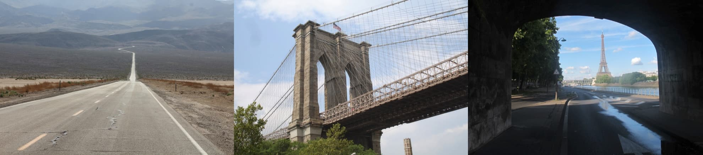

# Landmark Classification & Tagging for Social Media

Photo sharing and photo storage services like to have location data for each 
photo that is uploaded. With the location data, these services can build
 advanced features, such as automatic suggestion of relevant tags or 
automatic photo organization, which help provide a compelling user 
experience. Although a photo's location can often be obtained by looking
 at the photo's metadata, many photos uploaded to these services will 
not have location metadata available. This can happen when, for example,
 the camera capturing the picture does not have GPS or if a photo's 
metadata is scrubbed due to privacy concerns.

If no location metadata for an image 
is available, one way to infer the location is to detect and classify a 
discernible landmark in the image. Given the large number of landmarks 
across the world and the immense volume of images that are uploaded to 
photo sharing services, using human judgment to classify these landmarks
 would not be feasible.

This project is the first step towards addressing this problem by building models to 
automatically predict the location of the image based on any landmarks 
depicted in the image. It goes through the machine learning design 
process end-to-end: performing data preprocessing, designing and 
training CNNs, comparing the accuracy of different CNNs, and deploying 
an app based on the best trained CNN.

Examples from the landmarks dataset - a road in Death Valley, the Brooklyn Bridge, and the Eiffel Tower

## Acknowledgement

This project was completed as part of the Udacity "Machine Learning Fundamentals" Nanodegree under "AWS AI & ML Scholarship" program.
